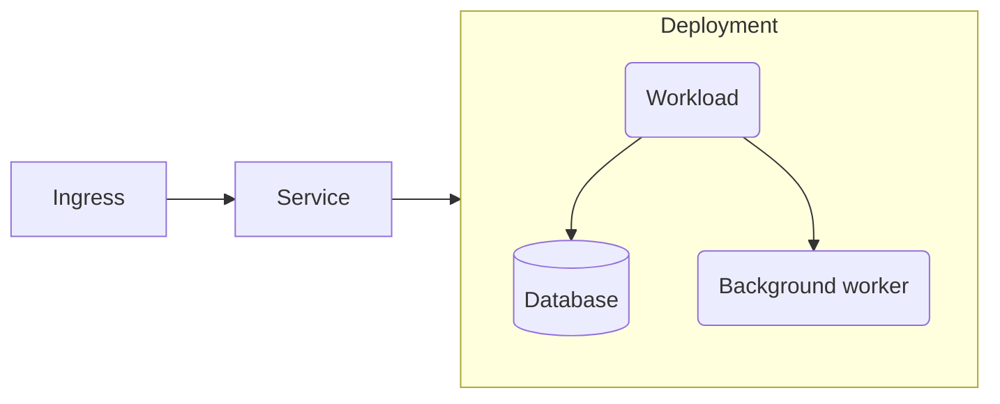
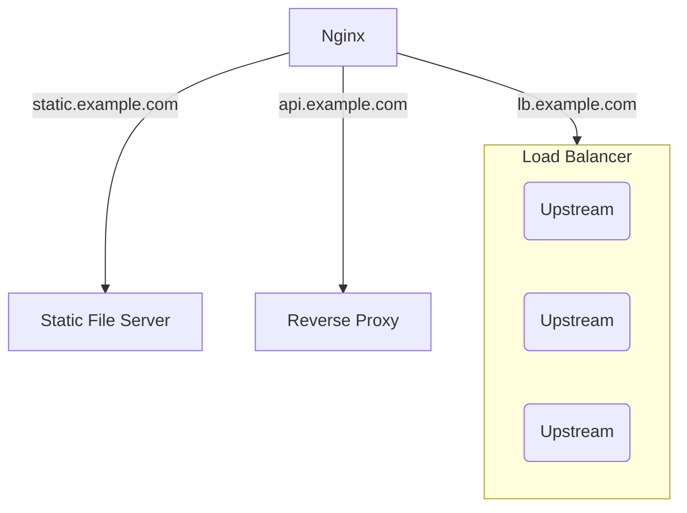

# What's in a deployment?

!!!warning :fire: Here be dragons
If you're not familiar with how Kubernetes exposes services to any network, let alone the internet, check [**:icon-light-bulb: Networking**](/kubernetes-fundamentals/networking) for a more general overview.
!!!

While Kubernetes has more than one way of exposing a workload to the internet, a common method is to attach an `Ingress` to a `Service`.

In its most basic form, the arragement will look something like this:

An ingress by itself won't achieve much without a corresponding ingress controller, though.

## Ingress controllers

An ingress controller manages ingresses in a cluster, but what exactly does that mean?

Without digging into heavy technical detail, an easy way to imagine this arrangement is to compare it to a similar setup with Nginx.

A single Nginx instance can route incoming traffic to multiple 'servers', typically by matching a hostname up to a configuration. A server in this sense could be a simple static file server that reads files from a directory on disk, or it could act as a reverse proxy by directing the request to a service listening on another port or even on a different server.

An ingress controller more or less takes the place of Nginx as a load balancer in this setup, and an ingress is how an incoming request is routed to a service resource that sits in front of your deployment. If you don't create an ingress then traffic can't make it to your service, and it will only be privately available on the internal network.

### Cloud defaults

If you stick to the default settings in almost any hosted Kubernetes environment you'll end up with a cloud-provided ingress controller. This will be enough to get the job done but, depending on the cloud and how it implements the controller, you might incur extra costs. This is because an ingress controller will require a load balancer that is exposed to the internet and can handle both HTTP and HTTPS requests.

Instead, it's useful to set up a custom controller instead.

## Custom ingress controllers

A custom ingress controller will offer a lot more power and flexibility than the one you get out of the box. If you take Nginx as an example again, it does a lot more than simply mapping requests to services and there is a hell of a lot to fine-tune depending on your needs.

In most cases you'll do this configuration in a declarative manner through a collection of annotations or labels, but we'll get to that soon.

In the rest of the chapter you'll set up a custom ingress controller using Kubernetes' very own [ingress-nginx](https://github.com/kubernetes/ingress-nginx). As a bonus, you'll get support for SSL too.

